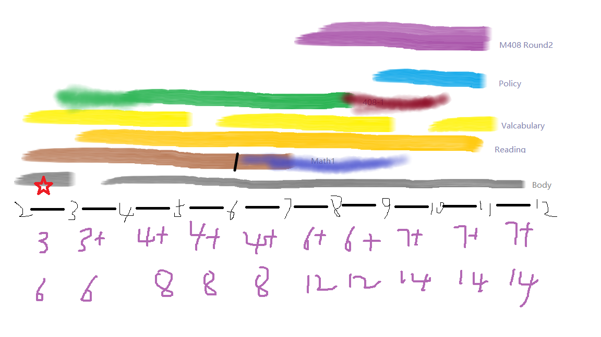

# 考研企划

* * *

## 数学

* _不_ 进行一个月内完成的快速复习，在6月17号完成四门课的一整轮复习，包括教材例题和部分的基础篇讲义练习题

* 6月17到9月底练习考研真题

* 9月底开始巩固提高，了解物理知识，针对一卷特点练习，查缺补漏书中定理的证明以及了解数学竞赛的题目，期间做模拟题

* 对于线代的概率论（概率论用浙大教材）先用考纲对照复习，概念不清楚的地方递归复习

* 苏德矿的课可以再第三阶段找重点仔细观看

* * *

## 专业课

* 一门一门来，计划顺序是数据结构-操作系统-组成原理-网络

* 复习两轮，第一轮9月底完成（暑假是黄金时间）

* 对于浙大，需要特异性准备PAT机试（暑假是黄金时间）

* 比较偏的考点可以先搁置，留到12月左右再记忆不容易忘记

[back](./)